# Capstone Project Solution-1

Below are the images demonstrating my solution for the GCP Capstone Project (Lab-7).

### Phase 1: Foundation (Network & Identity)

**1.1: VPC [Virtual Private Cloud]**  
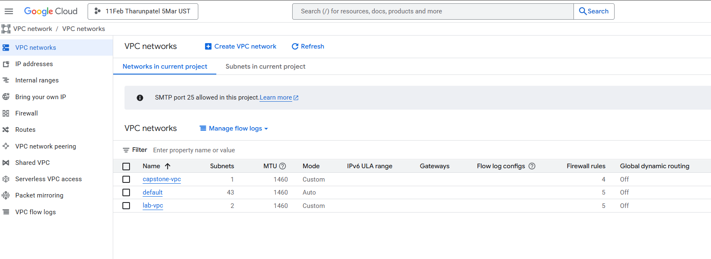

**1.2: Firewall Rules**  
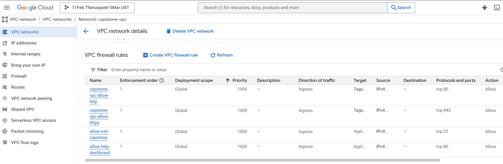

**1.3: Service Account**  
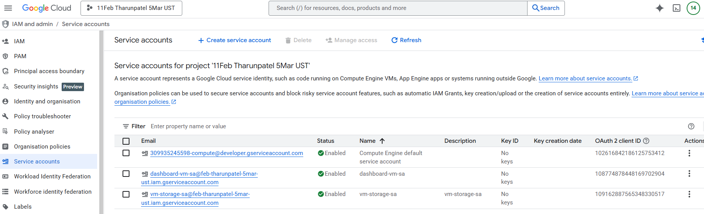

---

### Phase 2: Content Storage

**2.1: Cloud Storage Bucket**  
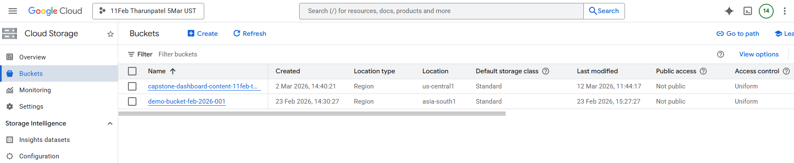

**2.2: Adding Permission to Bucket**  
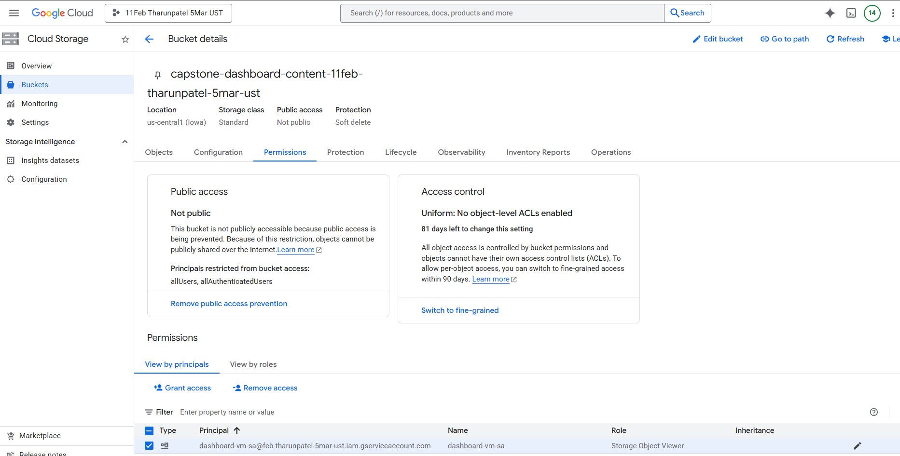

**2.3: Upload to Bucket**  
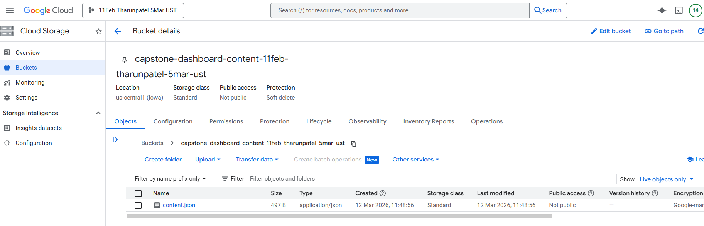

---

### Phase 3: Compute (Web Server)

**3.1: VM Instance Setup**  
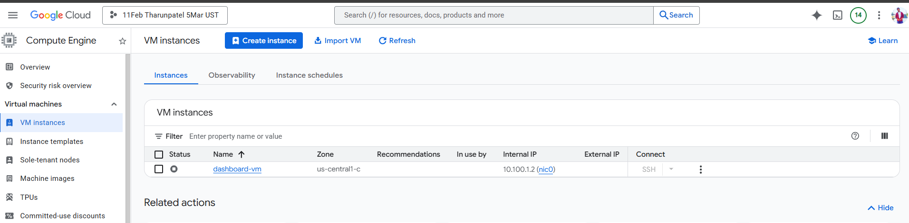

**3.2: Startup Script & Deployment**  
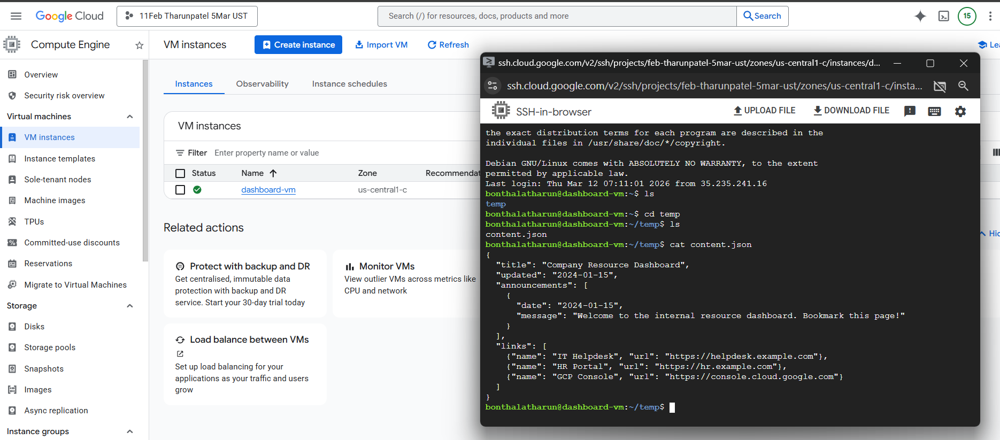

<!-- **3.3: Dashboard Verification**  
 -->

---

### Phase 4: Observability

**4.1: Monitoring Dashboard**  
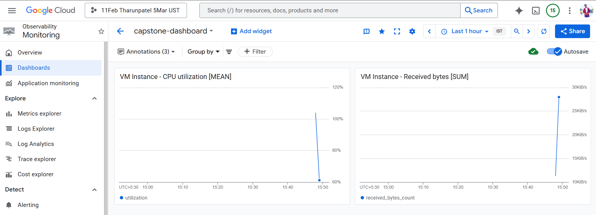

**4.2: Alert Policy Configuration**  
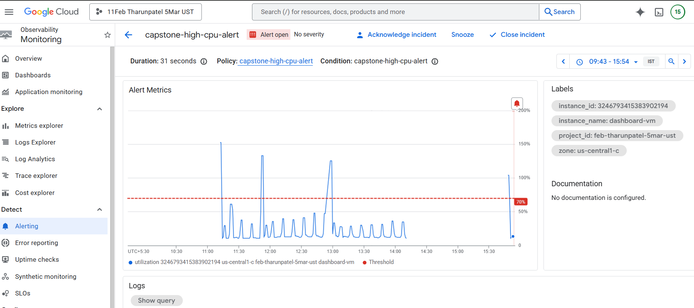

**4.3: Applying Labels**  
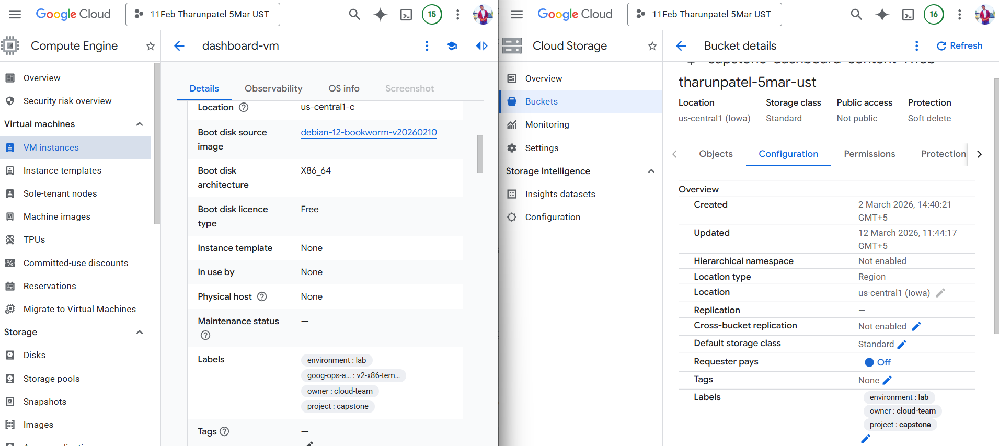

---

### Phase 5: Content Update Flow

**Dashboard Reflecting New Content**  
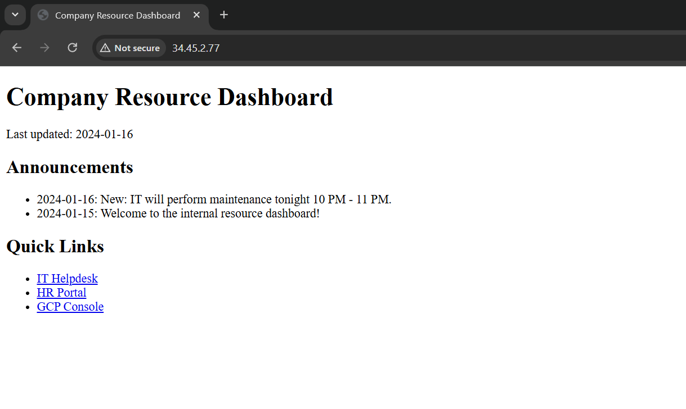

---

### Key Takeaways

- Multi-service integration: VPC, Compute Engine, Cloud Storage, IAM, Monitoring, and Logging work together seamlessly.
- Decoupled content: Cloud Storage allows IT to update the dashboard without touching servers.
- Service accounts: Use VM-attached identity to securely access Storage without storing credentials.
- Observability: Monitoring dashboards, alerts, and labels ensure production readiness.
- End-to-end validation: Full flow tested, including content updates and security checks.

---