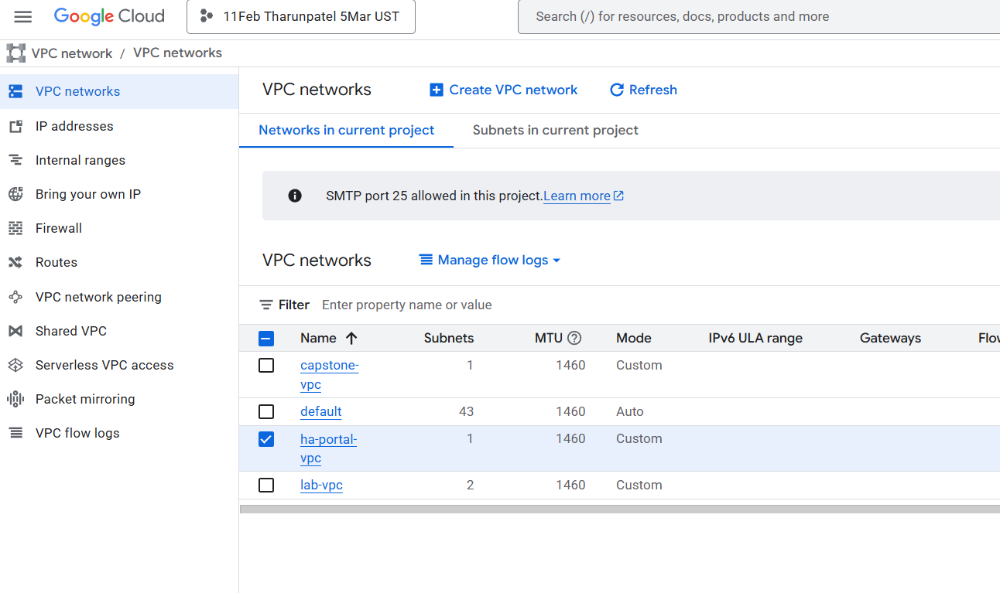
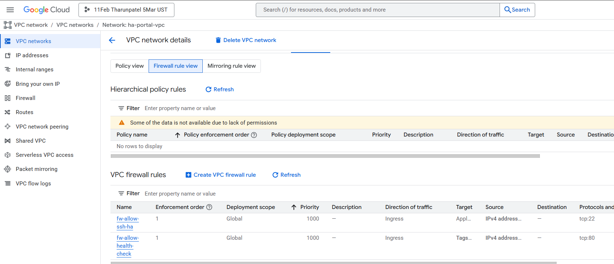
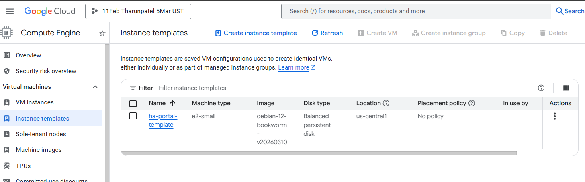
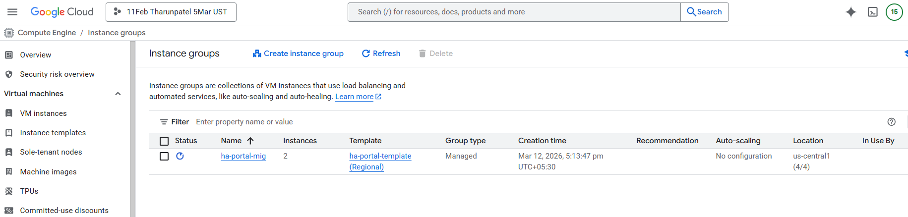
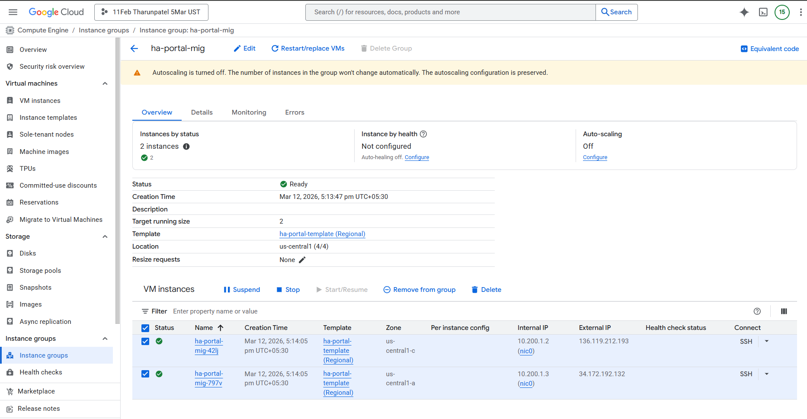
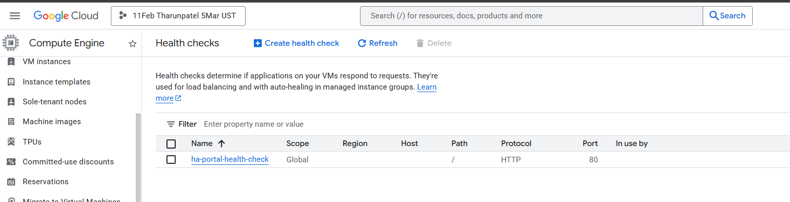
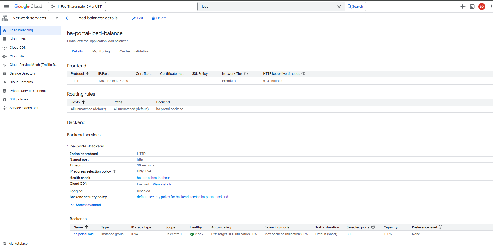
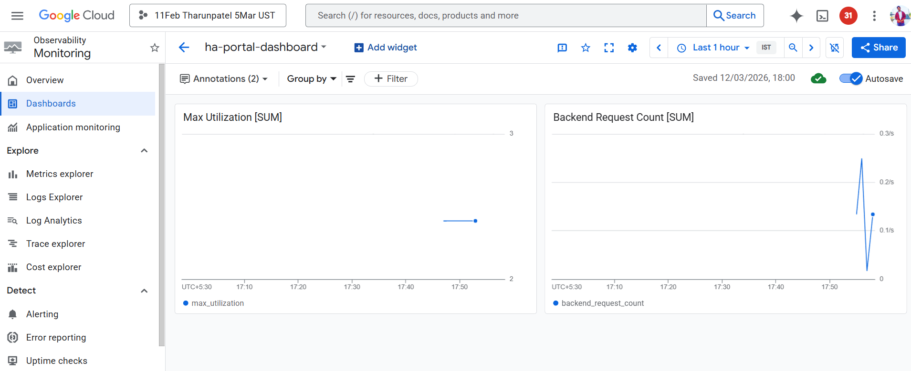

# Capstone Project-2 Solution (High-Availability Web Service)

This repository contains the **Lab 8 solution** from the GCP Foundation Bootcamp, demonstrating a **high-availability customer-facing service status portal** with **load balancing, managed instance groups, and monitoring**.

---

## Phase 1: Network Foundation

### 1.1: VPC [Virtual Private Cloud]  
**VPC Name:** `ha-portal-vpc`  
**Subnet:** `ha-portal-subnet` (10.200.1.0/24)  

### 1.2: Firewall Rules  

- **Health Check Rule:** Allows traffic from `130.211.0.0/22` and `35.191.0.0/16` to port 80 on instances tagged `allow-health-check`  
- **SSH Rule:** Allows TCP:22 from your IP for troubleshooting  

---

## Phase 2: Backend VMs

### 2.1: Instance Template  

**Template Name:** `ha-portal-template`  
- Debian-based VM, `e2-micro`  
- Network: `ha-portal-vpc`, Subnet: `ha-portal-subnet`  
- Tag: `allow-health-check`  
- Startup script installs Apache and serves status page showing VM name & zone  

### 2.2: Managed Instance Group (MIG)  

**MIG Name:** `ha-portal-mig`  
- Regional, 2 VMs spread across **us-central1-a** and **us-central1-b**  
- Named port: `http:80`  

### 2.3: Backend Verification  

Accessing each VM directly confirms Apache serves page with hostname & zone:  

---

## Phase 3: HTTP Load Balancer

### 3.1: Health Check  

**Name:** `ha-portal-health-check`  
- HTTP, port 80, path `/`  
- Ensures only healthy backends receive traffic  

### 3.2: Backend & Frontend Setup and Load Balancer Verification 

- **Backend Service:** `ha-portal-backend` → `ha-portal-mig` instance group, port 80, health check applied  
- **Frontend:** HTTP, ephemeral IPv4, port 80  
- LB distributes traffic across 2 VMs  
- Both VMs show **Healthy**  

---

## Phase 4: Observability

### 4.1: Monitoring Dashboard  

**Dashboard Name:** `ha-portal-dashboard`  
- Widgets: Load balancer request count, backend CPU utilization, health check status  

---

## Key Takeaways

| Concept | Outcome |
|---------|---------|
| **High Availability** | 2 VMs in 2 zones; zone or VM failure does not affect service |
| **Load Balancer** | Single external IP distributes traffic to healthy backends |
| **Health Checks** | Automatic removal of unhealthy VMs from backend pool |
| **Firewall Rules** | GCP health check IP ranges allowed; HTTP and SSH rules enforced |
| **Observability** | Dashboard + logs allow monitoring LB and backend health |
| **End-to-End Testing** | Service verified under normal and VM-failure conditions |

---

**Solution Summary:**  

This project demonstrates a **resilient, customer-facing web service** with:

- 2 VMs in a **regional MIG**
- **HTTP Load Balancer** distributing traffic
- **Health checks** ensuring only healthy backends serve requests
- **Custom VPC and firewall rules** for security
- **Monitoring and logging** for observability

The service remains fully available even if **one VM or one zone fails**, meeting the **high availability requirement**.

---